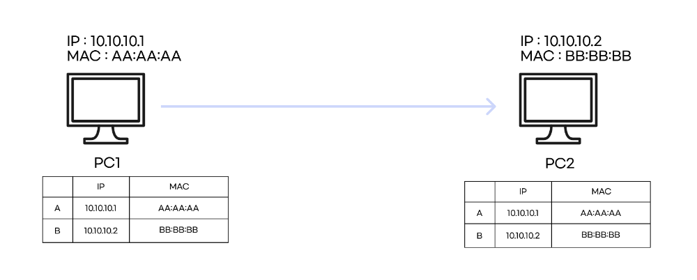
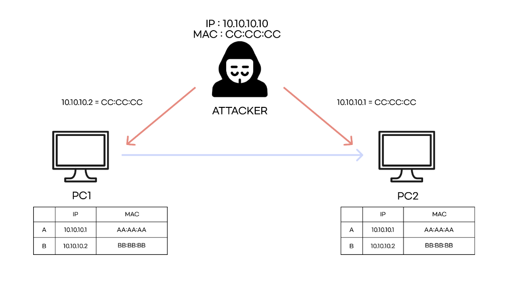
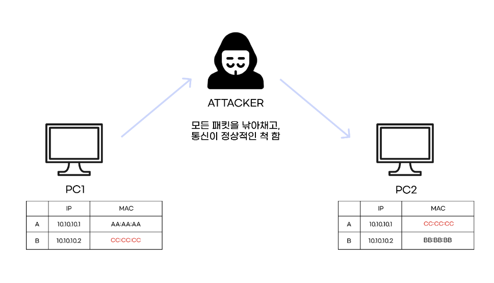

# ARP_Spoofing
#### ARP Spoofing은 근거리 통신망 하에서 주소 결정 프로토콜 메시지를 이용하여 상대방의 데이터 패킷을 중간에서 가로채는 중간자 공격 기법입니다. 이 공격은 데이터 링크 상의 프로토콜인 ARP 프로토콜을 이용하기 때문에 근거리 상의 통신에서만 사용할 수 있는 공격입니다.

## 정상적인 통신

원래는 이런 식으로, ARP 프로토콜을 통해 서로의 MAC 주소를 알게 되고 MAC TABLE에 서로의 물리적 주소를 알고 통신합니다.

## ARP Spoofing 공격

ARP Attack시, ATTACKER가 위 그림처럼 각 PC에게 자신의 MAC 주소와 원래 통신하던 상대의 IP 주소를 매핑시킵니다.

공격이 성공하면, 위 그림처럼 MAC TABLE이 변조되어, 원래 통신하던 대상의 IP 가 공격자의 MAC 주소와 매핑되어 있습니다.   
공격자는 자신에게 온 패킷을 중계하며, Frame Relay를 하여 통신이 정상적으로 이루어지는 척 합니다. 이런 과정을 통해 상대방의 패킷을 몰래 볼 수 있게 됩니다.

## 대응 방안
MAC TABLE을 정적(수동)으로 설정합니다.   
XArp, ARPWatch와 같은 ARP SPoofing 공격 탐지 툴을 설치합니다.