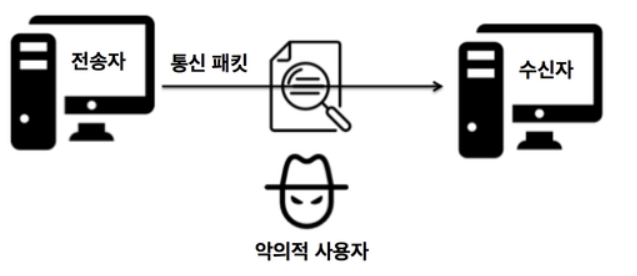
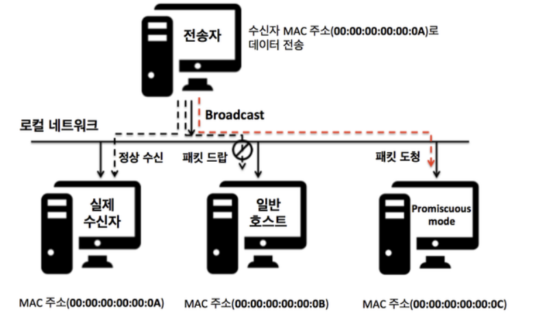

# Sniffing

## 스니핑의 개념
Sniffing이란 단어의 사전적 의미는 ‘코를 킁킁거리다’, ‘냄새를 맡다’ 등의 뜻이 있습니다. 사전적인 의미와 같이 해킹 기법으로써 스니핑은 네트워크 상에서 자신이 아닌 다른 상대방들의 패킷 교환을 엿듣는 것을 의미합니다. 간단히 말하여 네트워크 트래픽을 도청하는 과정을 스니핑이라고 할 수 있습니다.

## 스니핑
스니핑은 네트워크상에서 전송자와 수신자 사이에 주고 받는 데이터를 패킷 수준으로 분석하여 계정, 비밀번호, 프로토콜, 시스템 정보 등 유의미한 내용을 알아내기 위한 해킹 기법입니다. 

## 대응 방안
TLS 같은 암호화된 통신을 사용해서 데이터를 읽기 어렵게 합니다.   
VPN을 사용해 통신을 암호화 합니다.   
방화벽(침입 차단 시스템), 침입 방지 시스템(IPS), 침입 탐지 시스템(IDS)과 같은 보안 소프트웨어 사용해 네트워크 트래픽 보안을 강화합니다.