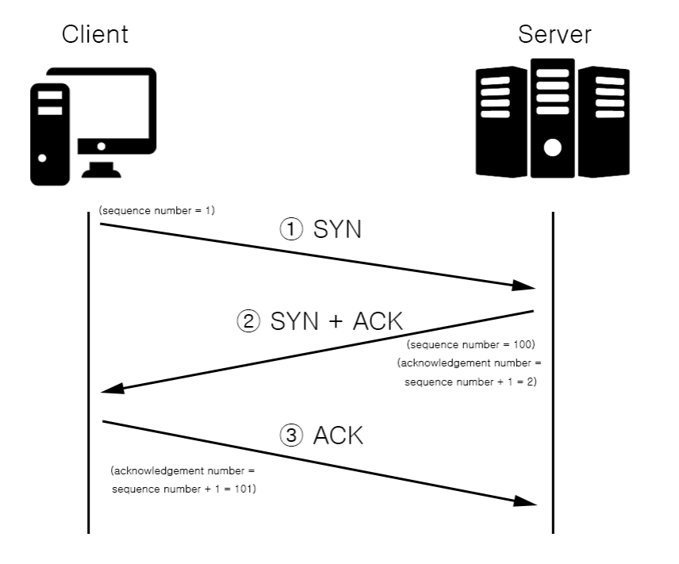
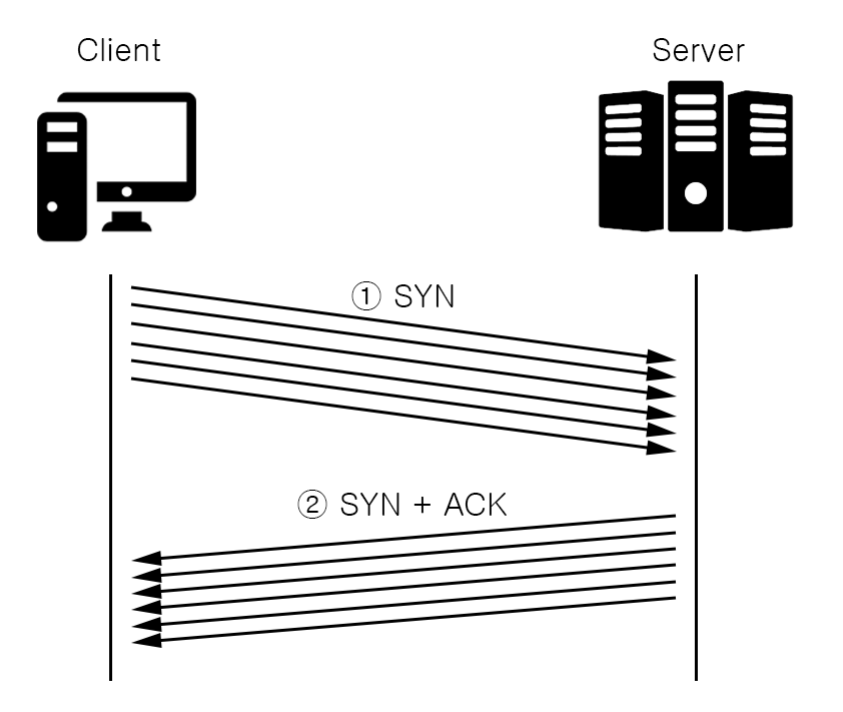

# SynFlood Attack
## 3-way handshake
#### 먼저 TCP(전송 제어 프로토콜)란 메시지를 보내기 전에, 3-way-handshake 과정을 통해서 메시지를 정상적으로 전달할 수 있는지 확인합니다.

#### TCP는 세 차례의 패킷들을 주고받는 과정을 거쳐야만 TCP 연결이 성립됩니다. 패킷을 주고받는 내용들은 아래와 같습니다.

① Client는 SYN 패킷(sequence number 포함)을 생성해서, Server에게 전달합니다.    
② Server는 SYN 패킷(sequence number 포함)과 받은 SYN의 대답 격인 ACK 패킷(acknowledgement number 포함)을 Client에게 전달합니다. 그리고 Server는 Client의 접속을 받아들이기 위해, RAM(메모리)에 일정 공간을 확보해둡니다. acknowledgement number의 값은, 방금 받은 SYN 패킷의 sequence number 값에 일정 값을 증가시켜서 보냅니다.      
③ 그리고 다시 Client는 방금 받은 SYN의 대답 격인 ACK 패킷(acknowledgement number 포함)을 Server에게 전달합니다. 여기서도 마찬가지로 acknowledgement number의 값은, 방금 받은 SYN 패킷의 sequence number 값에 일정 값을 증가시켜서 보냅니다.
이렇게 Client는 Server에 Established 상태로 연결이 됩니다.

## SynFlood Attack이란
#### SYN Flooding은, 위 3-way-handshake의 ②번 과정에서 언급했던 내용과 관련이 있습니다.

Client가 ①SYN 패킷만을 계속적으로 보내고 ③ACK 패킷을 안보내게 되면, Server는 Client의 연결을 받아들이기 위해 RAM(메모리) 공간을 점점 더 많이 확보 해둔 상태에서 대기합니다.   
그리고 Server의 RAM이 꽉 차게 되면 더 이상 연결을 받아들일 수 없게 되고, Server는 서비스를 계속할 수 없는 상태가 됩니다. 이러한 공격은 SYN Flooding attack이라고 합니다.

## 대응 방안
### SYN Cookie
방화벽 단에서 SYN을 먼저 받고, SYN Cookie를 포함한 SYN+ACK를 보내는 방법이 있습니다. 일정 시간 동안 SYN Cookie에 대한 정상적인 응답 패킷이 들어오지 않으면 방화벽에서 차단하고, 정상적인 패킷이 들어오면 통신이 가능하게 해주는 방식입니다.